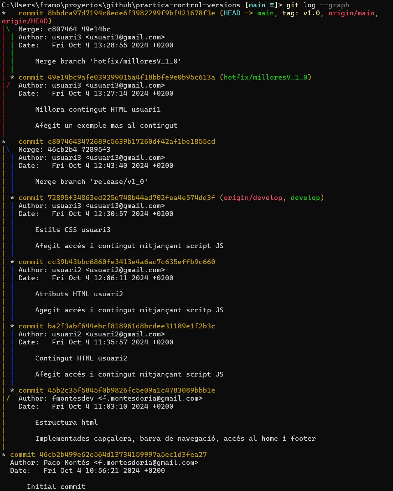
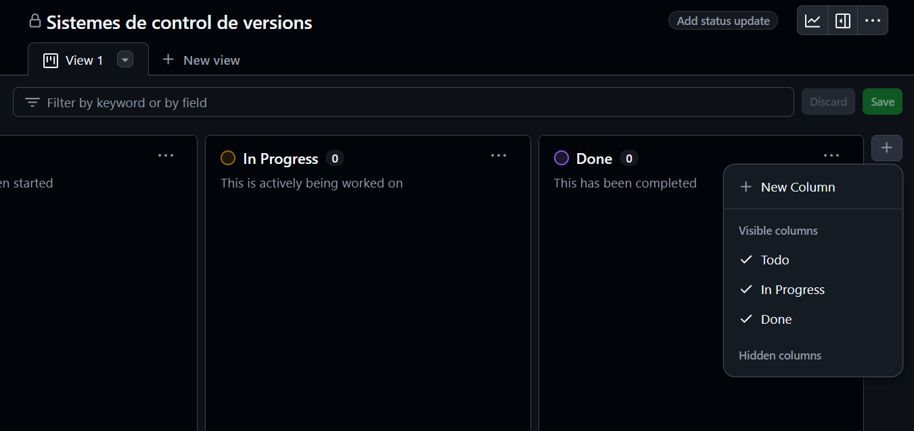

# Índex
- [Introducció a Git](#introducció-a-git)
- [Què és Git Flow?](#què-és-git-flow)
- [Per què hem utilitzat Git Flow al nostre projecte?](#per-què-hem-utilitzat-git-flow-al-nostre-projecte)
- [Usuari 1](#usuari-1)
  - [Feature Estructura HTML](#estructura-html)
- [Usuari 2](#usuari-2)
  - [Feature Contingut HTML](#contingut-html)
  - [Feature Atributs HTML](#atributs-html)
- [Usuari 3](#usuari-3)
  - [Feature Estils HTML](#estils-html)
  - [Release](#release)
- [Represa Usuari 1](#represa-usuari-1)
  - [Hotfix Millora Contingut HTML](#millora-contingut-html)
  - [GitHub Pages](#github-pages)
  - [Projecte](#projecte)

# Introducció a Git
Git és un sistema de control de versions distribuït, utilitzat principalment en el desenvolupament de programari per gestionar els canvis en el codi font de manera col·laborativa i eficient. Va ser creat per Linus Torvalds el 2005, amb l’objectiu de donar suport al desenvolupament del nucli de Linux. Git permet als desenvolupadors treballar en paral·lel, mantenint un registre detallat de tots els canvis realitzats, i facilita la fusió de codi i la resolució de conflictes.

# Què és Git Flow?
Git Flow és una metodologia de ramificació (branching) que defineix un flux de treball estructurat per gestionar el cicle de vida del desenvolupament de programari. Va ser proposada per Vincent Driessen el 2010 i s'ha convertit en una pràctica estàndard per a molts equips de desenvolupament. El flux de treball de Git Flow es basa en diverses branques amb propòsits específics, que ajuden a organitzar el desenvolupament i el desplegament de noves versions.

Branques Principals en Git Flow:
- Branca main: Conté el codi en producció, és a dir, la versió estable del programari. Només s'actualitza amb versions finalitzades.
- Branca develop: Serveix com a base per al desenvolupament de noves característiques. Un cop les funcionalitats s'han provat i completat, es fusionen aquí per preparar-les per al següent llançament.

Branques Auxiliars:
- Branques de feature: Utilitzades per desenvolupar noves funcionalitats. Cada característica o funcionalitat nova es desenvolupa en la seva pròpia branca de feature, que parteix de develop i, un cop completada, es fusiona de nou a develop.
- Branques de release: Serveixen per preparar una nova versió. Quan develop té un conjunt de característiques llestes per al llançament, es crea una branca release per realitzar proves finals i corregir errors.
- Branques de hotfix: Ús per corregir errors crítics en el codi en producció (a main). S'utilitza per aplicar canvis ràpids i urgents que necessiten una solució immediata.

# Per què hem utilitzat Git Flow al nostre projecte?
La metodologia Git Flow ofereix molts avantatges per als equips de desenvolupament:

- Organització Estructurada: La separació de branques fa que sigui fàcil mantenir versions estables mentre es desenvolupen noves característiques.
- Facilita el Treball Col·laboratiu: Amb Git Flow, cada desenvolupador pot treballar en una branca independent sense interferir amb el codi dels altres.
- Control del Cicle de Vida del Projecte: Permet definir clarament quin codi està llest per a producció i quin encara es troba en fase de desenvolupament o proves.
- Gestió Eficaç de Llançaments: Les branques de release asseguren que les noves versions es despleguen només després de proves finals, mentre que les branques de hotfix permeten solucionar problemes urgents amb rapidesa.

En resum, Git Flow ajuda a mantenir el desenvolupament de manera ordenada, oferint un marc clar i eficient per al treball col·laboratiu i la gestió de versions. Utilitzar Git Flow és una bona pràctica per assegurar-se que el codi es desenvolupa de manera estructurada i que cada versió llançada compleix amb els estàndards de qualitat del projecte.

# Usuari 1

## 1️⃣ __Estructura HTML__

# Usuari 2

## 1️⃣ __Contingut HTML__

## 2️⃣ __Atributs HTML__

# Usuari 3

## 1️⃣ __Estils HTML__

## 2️⃣ __Release__

# Represa Usuari 1

## 1️⃣ __Millora Contingut HTML__

El comandament git flow hotfix finish milloresV_1_0 ha realitzat correctament el merge sobre main i sobre develop per ha fallat eliminant la branca hotfix. Al git log --graph que veiem a continuació s'aprecia com apareix la branca. Amb git branch -d hotfix/milloresV_1_0 hem forçat la eliminació. Al últim git log podem apreciar com la branca ja no apareix.

Per un error al simular tres usuaris diferents, en aquest pas apareix als commits l'usuari 3, pero realment s'han fet amb l'usuari 1. Es pot veure al nom de la carpeta del respositori que es practica-control-versions i no practica-control-versions3. Ho hem corregit a la configuració.

## 2️⃣ __GitHub Pages__

Canviarem a la branca main des d'on crearem la nova branca gh-pages.

Elmininem els arxius que no nocessitem, i realitzarem un primer commit.

Amb un push muntarem la nova branca al repositori remot.

Ja en GitHub, en settings/pages accedirem a la creació de la nostra GitHub Page asociant-la amb la branca creada (gh-pages)

Modificarem el arxiu README per afegir tota la documentació requerida, i totes les imatges que necessitem.

Realitzarem un commit de totes les modificacions.

I amb un push el muntarem al repositori remot on quedarà disponible.

## 3️⃣ __Creació de projecte__

Crearem un projecte de tipus "Board" amb el nom de la pràctica: Sistemes de control de versions.

Elminarem les columnes creades per defecte i afegirem una per a "features" i altra per a "hotfixs".

Procedirem a agegir les issues desde el nostre repositori "practica-control-versions".

Al crear el projecte posteriorment a la realització del commits respectius, comentarem les issues per a que queden referenciades amb el seu commit corresponent.
En cas de haver-lo creat inicialment, haguerem tancat les issues amb el mateix commit simplement indicant al missatge del mateix "closes #1" on el número correspon al número de la issue.

Podem veure al projecte creat com totes les issues que haviem afegit a les columnes de "Features" i "Hotfix" están completades.

Per últim, desde els settings del projecte, afegim com a colaborador al usuari antoni-gimenez.

Pràctica: Sistemes de Control de Versions.  
Assignatura: Desplegament d'apliacións WEB.  
Curs: 2n DAW.  
Autor: Francisco Montés Doria.  
Centre: IES L'Estació Ontinyent.
