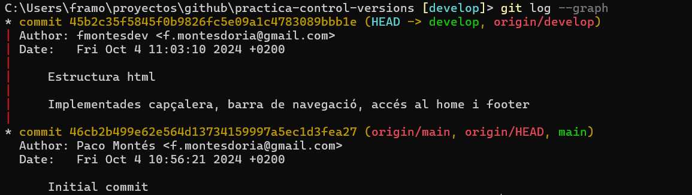

# Índex
- [Introducció a Git](#introducció-a-git)
- [Què és Git Flow?](#què-és-git-flow)
- [Per què hem utilitzat Git Flow al nostre projecte?](#per-què-hem-utilitzat-git-flow-al-nostre-projecte)
- [Accions usuari 1](#accions-usuari-1)
  - [Feature Estructura HTML](#feature-estructura-html)
- [Accions usuari 2](#accions-usuari-2)
  - [Feature Contingut HTML](#feature-contingut-html)
  - [Feature Atributs HTML](#feature-atributs-html)
- [Accions usuari 3](#accions-usuari-3)
  - [Feature Estils CSS](#feature-estils-css)
  - [Release](#release)
- [Represa accions usuari 1](#represa-accions-usuari-1)
  - [Hotfix Millora Contingut HTML](#hotfix-millora-contingut-html)
  - [GitHub Pages](#github-pages)
  - [Creació de projecte](#creació-de-projecte)

# Introducció a Git
Git és un sistema de control de versions distribuït, utilitzat principalment en el desenvolupament de programari per gestionar els canvis en el codi font de manera col·laborativa i eficient. Va ser creat per Linus Torvalds el 2005, amb l’objectiu de donar suport al desenvolupament del nucli de Linux. Git permet als desenvolupadors treballar en paral·lel, mantenint un registre detallat de tots els canvis realitzats, i facilita la fusió de codi i la resolució de conflictes.

# Què és Git Flow?
Git Flow és una metodologia de ramificació (branching) que defineix un flux de treball estructurat per gestionar el cicle de vida del desenvolupament de programari. Va ser proposada per Vincent Driessen el 2010 i s'ha convertit en una pràctica estàndard per a molts equips de desenvolupament. El flux de treball de Git Flow es basa en diverses branques amb propòsits específics, que ajuden a organitzar el desenvolupament i el desplegament de noves versions.

Branques Principals en Git Flow:
- Branca main: Conté el codi en producció, és a dir, la versió estable del programari. Només s'actualitza amb versions finalitzades.
- Branca develop: Serveix com a base per al desenvolupament de noves característiques. Un cop les funcionalitats s'han provat i completat, es fusionen aquí per preparar-les per al següent llançament.

Branques Auxiliars:
- Branques de feature: Utilitzades per desenvolupar noves funcionalitats. Cada característica o funcionalitat nova es desenvolupa en la seva pròpia branca de feature, que parteix de develop i, un cop completada, es fusiona de nou a develop.
- Branques de release: Serveixen per preparar una nova versió. Quan develop té un conjunt de característiques llestes per al llançament, es crea una branca release per realitzar proves finals i corregir errors.
- Branques de hotfix: Ús per corregir errors crítics en el codi en producció (a main). S'utilitza per aplicar canvis ràpids i urgents que necessiten una solució immediata.

# Per què hem utilitzat Git Flow al nostre projecte?
La metodologia Git Flow ofereix molts avantatges per als equips de desenvolupament:

- Organització Estructurada: La separació de branques fa que sigui fàcil mantenir versions estables mentre es desenvolupen noves característiques.
- Facilita el Treball Col·laboratiu: Amb Git Flow, cada desenvolupador pot treballar en una branca independent sense interferir amb el codi dels altres.
- Control del Cicle de Vida del Projecte: Permet definir clarament quin codi està llest per a producció i quin encara es troba en fase de desenvolupament o proves.
- Gestió Eficaç de Llançaments: Les branques de release asseguren que les noves versions es despleguen només després de proves finals, mentre que les branques de hotfix permeten solucionar problemes urgents amb rapidesa.

En resum, Git Flow ajuda a mantenir el desenvolupament de manera ordenada, oferint un marc clar i eficient per al treball col·laboratiu i la gestió de versions. Utilitzar Git Flow és una bona pràctica per assegurar-se que el codi es desenvolupa de manera estructurada i que cada versió llançada compleix amb els estàndards de qualitat del projecte.

# Accions usuari 1

## __Feature Estructura HTML__

Amb l'usuari 1, creem el repositori "practica-control-versions" al GitHub de fmontesdev.

Clonem el repositori a local.

Iniciem el repositori per a poder executar els comandaments de git flow. Ens creará automáticament la branca main i develop.

Iniciem la primera feature "Estructura HTML". Ens creará una branca amb el mateix nom.

Realitzem les modificacions corresponents.

I executem el commit.

Ara procedirem a integrar la branca de feature creada amb la branca develop.

I amb un push muntarem els canvis a la branca develop en el repositori remot.

# Accions usuari 2

## __Feature Contingut HTML__

L'usuari 2 també clonara en local el respositori creat.

Canviarem de branca cap a develop

I iniciatitzarem el repositori per treballar amb git flow.

Crearem la nova branca feature "Contingut HTML".

Modificarem els arxius corresponents.

I realitzarem el commit.

Una vegada realitzada la feature, la integrarem a la branca develop.

I amb un push muntarem els canvis a la branca develop del repositori remot.

## __Feature Atributs HTML__

El mateix usuari 2 tornara a obrir altra branca feature anomenada "Atributs HTML".

Realitzarem les modificacions.

I procedirem amb el commit.

Per després integrar el canvis de la branca feature a la branca develop.

I pujar-ho tot a la branca develop del respositori remot.

# Accions usuari 3

## __Feature Estils CSS__

L'usuari 3 també es clonará el repositori creat.

Canviarem a la branca develop.

I inicialitzarem el repositori per a poder treballar amb git flow.

Com l'usuari 3 habia creat i iniciatlitzat el repositori abans que l'ususari 2 realitzara totes les modificacions, tenim que actualitzar la nostra branca develop, que es d'on arranquem les feature.

I creem una nova feature "Estils CSS".

Realitzem els canvis.

I procedim amb el commit.

Integrarem la branca feature creada amb la branca develop.

I sincronitzarem amb la branca remota.

## __Release__
Fins el moment, totes les modificacions que hem realitzat a través de diverses feature están recollides a la branca develop. Ens queda per tant, muntar eixos canvis definitius a la branca main. Així que l'usuari 3 creará una nova branca, esta vegada release, que iniciará desde develop i que realitzará un merge sobre les rames main i develop.

Etiquetarem aquesta versió com v1.0.

I Muntarem amb un push els canvis de la branca main al remot.

# Represa accions usuari 1

## __Hotfix Millora Contingut HTML__

L'usuari 1 rependrá les seves accións realitzan un hotfix. Primerament tindrem que actualitzar tant la branca develop com main amb els últims canvis reatlitzats.

Desde main iniciarem un hotfix per realitzar unes millores urgents.

Realitzarem els canvis.

I procedirem amb el commit.

Després, tancant el hotfix, integrarem el canvis realitzats sobre la branca main i develop. Pero l'usuari 3 a comés el error de amb la release, sols actualitzar la rama remota main per no la develop. Així al intentar integrar el hotfix en ha generat un error. A realitzat el merge a la branca main, pero no a develop ja que no tenia els últims canvis. Tampoc ens ha eliminat la branca hotfix.

Realitzem el push a la branca remota main.

Canviem de branca cap a develop.

Descarreguem els ultims canvis que ens falten a la branca develop. 

I manualment realitzarem un merge cap a develop desde la branca hotfix/milloresV_1_0:  
- git merge hotfix/milloresV_1_0  

Amb açò integrarem els últims canvis a develop. Ens quedará eliminar la branca hotfix/milloresV_1_0 manualment:  
- git branch -d hotfix/milloresV_1_0

L'ultim pas per reparar la errada será realitzar un push desde develop a la respectiva branca remota:
- git push

Al git log --graph podem apreciar com ja tenim ubicades a l'ultim commit totes les branques locals i remotes.

Per un error al simular tres usuaris diferents, en aquest pas apareix als commits l'usuari 3, pero realment s'han fet amb l'usuari 1. Es pot veure al nom de la carpeta del respositori que es practica-control-versions i no practica-control-versions3. Ho hem corregit a la configuració.

## __GitHub Pages__

Canviarem a la branca main des d'on crearem la nova branca gh-pages.

Elmininem els arxius que no nocessitem, i realitzarem un primer commit.

Amb un push muntarem la nova branca al repositori remot.

Ja en GitHub, en settings/pages accedirem a la creació de la nostra GitHub Page asociant-la amb la branca creada (gh-pages)

Modificarem el arxiu README per afegir tota la documentació requerida, i totes les imatges que necessitem.

Realitzarem un commit de totes les modificacions.

I amb un push el muntarem al repositori remot on quedarà disponible.

## __Creació de projecte__

Crearem un projecte de tipus "Board" amb el nom de la pràctica: Sistemes de control de versions.

Elminarem les columnes creades per defecte i afegirem una per a "features" i altra per a "hotfixs".

Procedirem a agegir les issues desde el nostre repositori "practica-control-versions".

Al crear el projecte posteriorment a la realització del commits respectius, comentarem les issues per a que queden referenciades amb el seu commit corresponent.
En cas de haver-lo creat inicialment, haguerem tancat les issues amb el mateix commit simplement indicant al missatge del mateix "closes #1" on el número correspon al número de la issue.

Podem veure al projecte creat com totes les issues que haviem afegit a les columnes de "Features" i "Hotfix" están completades.

Per últim, desde els settings del projecte, afegim com a colaborador al usuari antoni-gimenez.

Pràctica: Sistemes de Control de Versions.  
Assignatura: Desplegament d'apliacións WEB.  
Curs: 2n DAW.  
Autor: Francisco Montés Doria.  
Centre: IES L'Estació Ontinyent.
